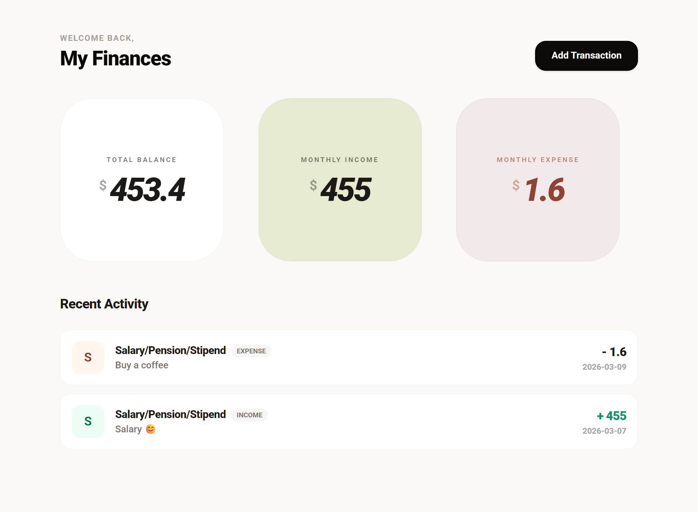

# 💰 My Finances – Personal Finance Tracker

A clean and simple **personal finance tracking web app** that helps users monitor their income, expenses, and overall balance in one place.



## ✨ Features

- 📊 **Dashboard Overview**
  - View total balance
  - Monthly income summary
  - Monthly expense summary

- 📈 **Monthly Cash Flow Chart**
  - Visual representation of income vs expenses over time
  - Helps quickly understand spending trends

- ➕ **Add Transactions**
  - Easily add new income or expense entries

- 🔎 **Transaction Search**
  - Search transactions by name or description
  - Example: _Rent, Coffee, Salary_

- 🎛 **Transaction Filters**
  - Filter transactions by type:
    - All
    - Income
    - Expense
  - Dropdown category selector
  - Option to reset filters

- 🧾 **Recent Activity**
  - See a history of your latest transactions
  - Clear labeling for income and expenses

- 🎨 **Modern UI**
  - Minimal and clean financial dashboard design
  - Easy-to-read financial cards
  - Responsive layout

## 🖼 Preview

The dashboard includes:

- **Total Balance Card**
- **Monthly Income Card**
- **Monthly Expense Card**
- **Monthly Cash Flow Chart**
- **Transaction Search & Filters**
- **Recent Activity Section**

Example:

- Salary added → `+455`
- Coffee purchase → `-1.6`
- Grocery shopping → `-100`

## 🛠 Tech Stack

Depending on your project, update this section if needed.

- **Frontend:** HTML, CSS, JavaScript
- **Framework:** React
- **Styling:** Tailwind

## 🚀 Getting Started

### 1. Clone the repository

```bash
git clone https://github.com/chikin-a/react-finance-tracker.git
```

### 2. Navigate to the project

```bash
cd react-finance-tracker
```

### 3. Install dependencies (if applicable)

```bash
npm install
```

### 4. Run the project

```bash
npm run dev
```

## 📁 Project Structure

```
react-finance-tracker/
│
├── public/
│   ├── image/
│
├── src/
│   ├── assets/
│   ├── components/
│   ├── context/
│   ├── features/
│   ├── hooks/
│   ├── types/
│   └── utils/
│
├── package.json
└── README.md
```

## 🎯 Future Improvements

- 📊 Advanced analytics for spending
- 📱 Mobile-first UI improvements
- 📂 Custom transaction categories

## 🤝 Contributing

Contributions are welcome!

1. Fork the repository
2. Create a feature branch
3. Commit your changes
4. Open a Pull Request

##

⭐ If you like this project, consider giving it a star on GitHub!
